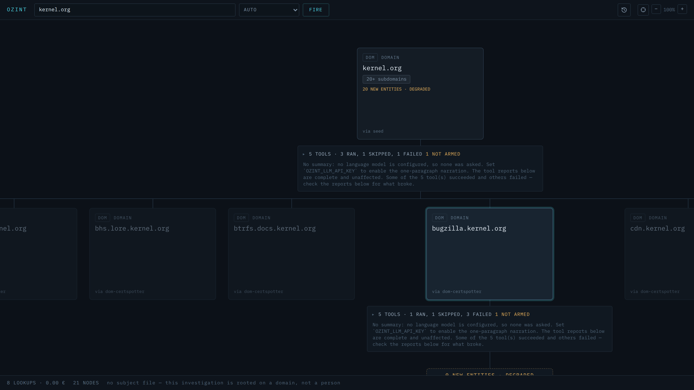
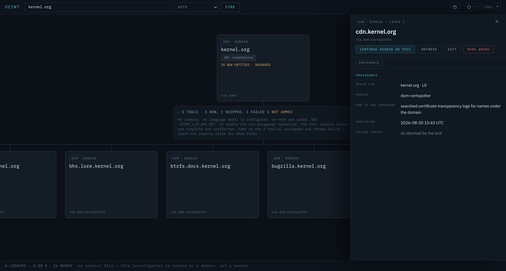

# OZINT

An OSINT investigation cockpit. Type a seed value — a username, an email, an IP, a domain,
a file hash, an image, a video URL, a pair of coordinates, a CVE id, a phone number, a name —
and watch a tree of typed, sourced findings grow, one deliberate click at a time.

Written in Rust, with a React cockpit. **62 catalogued tools, 45 of which need no API key at
all.** Runs entirely on your machine; there is no hosted service and no account.



*Two layers on `kernel.org`. The first found twenty subdomains in certificate transparency; the
band above them says what actually happened, tool by tool. Then one child was chosen — by hand,
which is the whole point — and fired in turn. That second layer is a dead end, and says so:
`0 NEW ENTITIES · DEGRADED`, `some tools broke — this layer is incomplete`. Shown as it comes
out of a fresh clone with no API keys and no Docker, which is why two of its tools are absent.*

> **Status: works, unpolished, and looking for help — including help deciding what it should
> become.** The engine is solid: 1 128 tests, twelve entity types, every one with a working
> orchestrator. What is rough is listed honestly in [STATUS.md](STATUS.md), and
> [ROADMAP.md](ROADMAP.md) has work scoped to be picked up alone. But the roadmap is one
> person's view from one desk — ideas, arguments and proposals are wanted at least as much as
> patches. See [Contributing](#contributing).

---

## What makes it different

**Nothing recurses on its own.** A layer fires, findings become child nodes, and every child sits
there `Idle` until you decide it is worth pursuing. Automated OSINT tools drown you in a thousand
nodes of which four matter; here you spend the fan-out yourself, so the tree stays the shape of
your actual reasoning.

**Every finding carries its provenance.** Which tool produced it, when, from which URL, and what
the raw response said. A finding you cannot trace is a rumour, so the detail panel leads with
where it came from rather than with what it claims.



*The panel opens on provenance, before anything else: which node it was found from, which tool,
how that tool obtained it, when, and whether a human has since corrected it.*

**The tools are deterministic.** All 62 of them are an HTTP call to a documented API and a
parser — no model in the loop, no summarisation standing between you and the source. An LLM is
used in exactly two optional places (narrating a settled layer, and disambiguating a seed whose
type is genuinely unclear), and both degrade honestly when no model is configured.

**It tells you what it did not do.** Every layer reports the tools it fired, the tools it skipped
for a missing key, and the ones that returned nothing — so an empty branch is legible as "we
looked and found nothing" rather than as "something went wrong somewhere".

**There is a kill switch.** `POST /api/safety/freeze` refuses every outbound call, process-wide,
persisted across restarts and failing closed if its own record is unreadable. Local reads and
annotations keep working, because a frozen instance must still be inspectable.

---

## Quick start

**Required:** Rust **1.88+** (let-chains, enforced by `rust-version`), Node **20.19+ or 22.12+**, and a C
toolchain — SQLite, the image decoders and the QR reader are all compiled from source
(`build-essential pkg-config libssl-dev` on Debian/Ubuntu).

**Optional, and only for the tools that shell out to them:**

| Binary | Needed by | Without it |
|---|---|---|
| `ffmpeg` / `ffprobe` | `video-local-probe` — keyframe extraction and container metadata | That tool reports itself unavailable; the rest of the video layer runs |
| `yt-dlp` | `video-ytdlp-probe` — resolving a video URL to its real media | Same |
| Docker | the four sidecars, below | They report as unreachable; the other 58 tools are unaffected |

```bash
git clone https://github.com/MyrLeProgrammeur/ozint
cd ozint

# 1. Build the cockpit
cd web && npm install && npm run build && cd ..

# 2. Run the server (serves the API and the cockpit on one port)
cargo run --release -p ozint-server
```

The first `--release` build takes several minutes. Then open <http://127.0.0.1:3000>, type
`torvalds` in the search bar, and fire. Give it about a minute: `wmn-probe` alone checks roughly
730 sites and is the slowest tool in the catalogue by an order of magnitude.

`PORT` changes the port. The server binds `127.0.0.1` and only that — see
[Please use this responsibly](#please-use-this-responsibly).

**Where your data goes.** Everything stays on your machine. Investigations, the nodes and their
raw tool responses, uploaded media and the freeze record are written to a SQLite database under
`.data/` (`OZINT_DATA_DIR` moves it, `OZINT_DB_PATH` moves just the database). Nothing is sent
anywhere except to the upstream APIs a tool is querying — and while frozen, not even those.

No configuration is needed to start. Copy `.env.example` to `.env` when you want to arm the
key-gated tools — every key it lists is free and self-serve, and the cockpit shows you per layer
which tools a key would have added.

### Developing

```bash
cargo run -p ozint-server          # terminal 1 — API on :3000
cd web && npm run dev              # terminal 2 — Vite on :5173, proxies /api
```

### The gates

Keep all five green before opening a pull request.

| Command | What it checks |
|---|---|
| `cargo test --workspace` | 1 128 Rust tests |
| `cargo clippy --workspace --all-targets` | Rust lints — must be warning-free |
| `cd web && npm run test` | 183 cockpit tests |
| `cd web && npm run typecheck` | `tsc --noEmit`, strict |
| `cd web && npm run lint` | ESLint |

---

## What it can investigate

Twelve entity types, each with its own plan of tools. A layer runs its tools in parallel, in
phases, with later phases conditional on what earlier ones found.

| Type | Some of what it does |
|---|---|
| **Username** | WhatsMyName (~730 sites), GitHub, Hacker News, Mastodon, Keybase, dev.to, Lobsters, Steam, Bluesky, Reddit, Gravatar, plus Maigret and Blackbird sidecars |
| **Email** | Gravatar, HudsonRock infostealer records, Microsoft credential-type probing, and a holehe sidecar sweeping ~120 sites for account existence |
| **Domain** | RDAP registration, DNS over Cloudflare, Certspotter certificate transparency, VirusTotal reputation, a SpiderFoot sidecar |
| **IP** | InternetDB, ipinfo, PeeringDB, AbuseIPDB, VirusTotal, GreyNoise, Censys, Netlas, offline MaxMind GeoLite2 |
| **Hash** | VirusTotal, MalwareBazaar, URLhaus, AlienVault OTX, Hybrid-Analysis, PolySwarm — tiered so the free quotas last |
| **Image** | Local EXIF (including GPS), perceptual hashing, QR decoding, SauceNAO reverse search |
| **Video** | Local ffmpeg keyframing, YouTube, Telegram, Bluesky, and a `yt-dlp` probe |
| **Coordinate** | Nominatim reverse geocoding, Overpass surroundings, GeoConfirmed's human-verified conflict placemarks, map deep links |
| **CVE** | NVD, MITRE, CISA KEV, EPSS scoring, public proof-of-concept search, Shodan exposure |
| **Phone** | Offline libphonenumber normalisation, Veriphone line type and carrier |
| **Name** / **Directory** | Launch tiles for people-search aggregators and dork builders — never fetched automatically, deliberately |

The full catalogue, with rate limits and which key arms what, lives in
[`crates/ozint/src/registry.rs`](crates/ozint/src/registry.rs) — that file is the single source
of truth, and it is worth reading before adding anything.

---

## Where things are

```
crates/ozint-core/     config, the shared HTTP pool, the SSRF guard, the freeze kill switch
crates/ozint-db/       the SQLite handle — and nothing else; each module owns its own tables
crates/ozint-llm/      a small OpenAI-compatible client; the only LLM dependency in the repo
crates/ozint/          the engine: registry, plans, the layer runtime, and all 62 sources
crates/ozint-server/   the axum HTTP surface and the freeze gate
web/                   the React cockpit — inline styles from one token table, no CSS framework
```

[ARCHITECTURE.md](ARCHITECTURE.md) walks through the life of a layer end to end and shows how to
add a source. [CONTRIBUTING.md](CONTRIBUTING.md) covers the conventions.

---

## Optional sidecars

Four tools run in Docker containers, because reimplementing them in Rust would be worse than
using them:

```bash
docker compose -f crates/ozint/docker/docker-compose.yml up -d
```

This starts **holehe** (email account existence across ~120 sites), **Blackbird** (username and
email sweeps), **Maigret** and **SpiderFoot**. They are optional: every other tool works without
Docker, and a layer whose sidecar container is down records that tool as `sidecar unreachable at
http://localhost:…` — an explicit failed outcome naming the address it tried, not a silent gap
and not a skip.

Blackbird, Maigret, holehe and SpiderFoot are third-party projects under their own licences
(Blackbird is GPLv3). They are fetched at build time and none of their code is redistributed by
this repository.

---

## What it does not do

- **It does not automate.** There is no crawl mode, no "expand everything", no scheduled
  re-runs. Every layer after the first is a click you made.
- **It does not touch anything private.** No credential stuffing, no login or registration flows
  to test account existence, no paywalled databases, no breach dumps, no dark web.
- **It does not phone home.** No telemetry, no account, no hosted component. The only outbound
  traffic is the tool you fired talking to the upstream it names.
- **It is not a monitoring system.** It answers a question you asked once; it does not watch.

## Please use this responsibly

Everything here queries public data through documented APIs, at the rate limits those APIs
publish. That does not make every use of it legitimate. Investigating a private individual who
has not consented is harassment in most of the world regardless of whether the underlying records
are public, and aggregating public records is precisely what makes them dangerous. This tool is
entirely capable of that: a username can chain to a real name to a people-search broker in one
session, which is the point of naming it here rather than leaving you to discover it.

**Two capabilities deserve to be called out by name**, because they are the ones you should think
hardest about before using:

- `email-hudsonrock` looks up whether an address appears in infostealer-malware records. The
  values it returns are masked upstream, but it is stolen-credential-adjacent by nature.
- The **Name** and **Directory** types build launch tiles — among them people-search brokers
  (Spokeo, BeenVerified, WhitePages, FastPeopleSearch, Radaris, Social Catfish) and face search
  (PimEyes), alongside dork builders, reverse-image engines and OpSec checkers. The module makes
  **no network calls at all**, deliberately, so this tool never queries a broker on your behalf.
  It hands you a link and lets you decide.

**A handful of tools carry terms-of-service risk** and you should know which: `email-microsoft-
credential-type` uses an unofficial Microsoft endpoint, and `video-telegram-resolve` parses
Telegram's public web preview HTML. Everything else uses a documented API. The user agent
identifies this tool honestly and is never spoofed.

Written for security research, threat intelligence, verification work and authorised
investigation. If your use would not survive being described out loud to the person you are
looking into, do not use this.

You are responsible for complying with the terms of service of every upstream API you query and
with the law where you are.

---

## Contributing

This project needs other people more than it needs anything else. It is built in the evenings by
one person, and the surface area — 53 upstream APIs, all of which change without warning — is
already larger than one person can keep healthy.

**But maintenance is the smaller half of what I am asking for.** The direction is not settled and
I do not want it to be. If you do this work for real, you know things about it that I do not, and
I would rather hear that than have you quietly patch a parser.

So the most valuable thing you can send is often not code:

- **Tell me what an investigation actually needs.** Which entity type is missing, which source is
  worth more than the six it would sit beside, what you reach for in another tool and cannot find
  here. I built the catalogue from what I could verify, not from a working analyst's day.
- **Argue with a design decision.** The one-click-per-layer rule, the refusal to automate, the
  loopback-only bind, the deliberate absence of a model between you and the source — each of
  those is a choice, each is written down with its reasoning, and each is arguable. Open an issue
  and argue. Changing my mind is a contribution.
- **Propose a feature and let it be discussed before you build it.** No roadmap item is sacred and
  [ROADMAP.md](ROADMAP.md) is not a queue — it is what one person could see from where he was
  standing. If you think something on it is wrong, or that something absent from it matters more,
  say so.
- **Show me how you actually use it.** A screenshot of your tree, an investigation that went
  somewhere, a workflow the UI fights you on. Nothing shapes a tool faster.

And the code, when you want it:

1. **Fix a dead source.** Upstream APIs break silently. Find one, fix the parser, add a test.
   Fastest way to help and needs no discussion.
2. **Add a source.** [ARCHITECTURE.md §5](ARCHITECTURE.md) is a worked example following a real
   existing file; the pattern is deliberately boring.
3. **Take something from [ROADMAP.md](ROADMAP.md).** Items there are scoped to be doable alone.

**There are open issues waiting.** Two are marked `good first issue`; one of them
([#7](https://github.com/MyrLeProgrammeur/ozint/issues/7)) wants an opinion rather than code and
is the easiest place to start if you have used tools like this for real.

Ideas, questions and criticism belong in an issue — including half-formed ones, and including
"why on earth does it do X". Small fixes: just send the pull request. Anything large: open an
issue first, so we agree on the shape before you spend an evening on it.

## Licence

MIT — see [LICENSE](LICENSE).

Several upstream sources require attribution as a condition of their licence, and the bundled
sidecars carry their own. Both are in [CREDITS.md](CREDITS.md), which a test keeps honest: a
source that declares an attribution and is not credited there fails the build.
